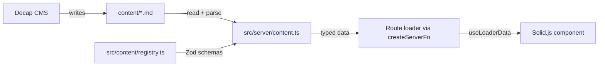

# CMS Content Layer

> **Status**: Implemented (February 2026).

## Table of Contents

1. [The Problem](#the-problem)
2. [Core Idea](#core-idea)
3. [Two Content Models](#two-content-models)
4. [The Registry as Single Source of Truth](#the-registry-as-single-source-of-truth)
5. [Data Flow](#data-flow)
6. [Validation](#validation)
7. [Alternatives Considered](#alternatives-considered)
8. [Revision History](#revision-history)

## The Problem

Editable site content — hero text, event dates, carousel images — was scattered across TypeScript constants (`CONSTANTS`, `CAROUSEL_IMAGES`) and inline JSX strings. Changing a date or a heading required a code change, a rebuild, and a deploy. Non-developers couldn't contribute at all.

We needed content to be editable through a CMS while keeping full type safety and build-time validation so that broken content never reaches production.

## Core Idea

Content lives in Markdown frontmatter files under `content/`, editable via Decap CMS. A **Zod schema registry** (`src/content/registry.ts`) defines the expected shape for every content type. Server-side accessor functions parse and validate the files at request time, returning fully typed data to route loaders.

Adding or changing a content field is a three-place change: the registry schema, the CMS config, and the Markdown file — but the compiler and validation script catch any mismatches.

## Two Content Models

The system distinguishes two kinds of content:

**Singleton pages** — one file per logical page (e.g. `content/pages/homepage.md`). Used for structured page-level copy that doesn't repeat. Accessed by key via `getPageContent('homepage')`.

**Folder collections** — a directory of files where each file is an item (e.g. `content/carousel/*.md`). Used for repeating content like carousel images or blog posts. Accessed via `getCollectionItems('carousel')`.

This mirrors Decap CMS's own `files` vs `folder` collection distinction, keeping the CMS config and the server layer conceptually aligned.

## The Registry as Single Source of Truth

`src/content/registry.ts` exports `pageSchemas` and `collectionSchemas` — plain objects mapping keys to Zod schemas. TypeScript derives the `PageKey` and `CollectionName` union types from these objects, so the accessor functions only accept keys that actually exist in the registry.

```typescript
const hero = getPageContent('homepage')    // typed as { hero_heading: string, ... }
const items = getCollectionItems('carousel') // typed as Array<{ image: string, alt: string, ... }>
```

Adding a new content type means adding a key + schema to the registry. The type system immediately surfaces any accessor that passes an invalid key, and the validation script catches missing files on disk.

## Data Flow



Routes wrap server-side content reads in `createServerFn` handlers, called from TanStack Router loaders. Components receive fully validated, typed data — no runtime parsing or null-checking needed in the UI layer.

## Validation

A standalone script (`scripts/validate-content.ts`, run via `npm run validate:content`) checks **bidirectional consistency**:

- Every registry key has a corresponding file/directory on disk
- Every file/directory on disk has a corresponding registry key
- All frontmatter passes its Zod schema

This runs as part of `npm run lint`, catching content drift in CI before it reaches production. It prevents two common failure modes: a CMS-created file that nothing reads (orphaned content), and a registry key that references a file nobody created yet (missing content).

## Alternatives Considered

**Keep constants in TypeScript**: Simple but locks out non-developer editing entirely. Every text change requires a PR.

**Full headless CMS (e.g. Sanity, Contentful)**: Adds a runtime dependency, API latency, and operational complexity. For a site this size, Git-backed Markdown gives the same editorial workflow without the infrastructure.

**Untyped frontmatter with ad-hoc parsing**: Faster to set up but pushes validation to the consumer. The registry approach catches shape mismatches at the boundary so components can trust the data.

**JSON content files instead of Markdown**: Would work for structured-only content but loses the ability to include rich-text body content (used by blog posts and potentially by future page sections).

## Revision History

- **2026-02-16** (Michael): Initial document capturing CMS content layer architecture
