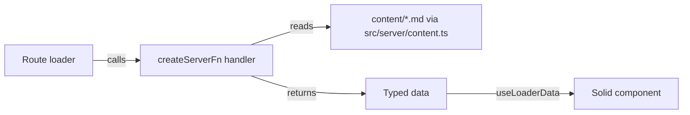

# Routing & Data Loading

> **Status**: Implemented (February 2026). Data loading strategy still evolving.

## Table of Contents

1. [Problem / Context](#problem--context)
2. [Decision](#decision)
3. [Route Structure](#route-structure)
4. [Data Flow: Loaders + Server Functions](#data-flow-loaders--server-functions)
5. [TanStack Query's Role](#tanstack-querys-role)
6. [Prerendering](#prerendering)
7. [Alternatives Considered](#alternatives-considered)
8. [Revision History](#revision-history)

## Problem / Context

The site has a mix of content types: static informational pages, a blog with dynamic slugs, CMS-managed carousel content, and a signup form. Data comes primarily from Markdown files on the server (see [CMS Content Layer](cms-content-layer.md)). The routing and data loading layer needs to handle SSR, prerendering, and type-safe navigation.

## Decision

Use **TanStack Solid Router** with file-based routing. Load data through **route loaders** that call `createServerFn` handlers. TanStack Query is installed and available but not yet the primary data loading mechanism.

## Route Structure

Routes live in `src/routes/` and follow TanStack Router's file-based conventions:

```
src/routes/
├── __root.tsx            # Root layout, providers, 404
├── index.tsx             # Homepage (/)
├── signup.tsx            # Signup form (/signup)
├── blog.index.tsx        # Blog listing (/blog)
├── blog.$slug.tsx        # Blog post (/blog/:slug)
├── info.date.tsx         # Info pages (/info/date, /info/prizes, etc.)
├── info.prizes.tsx
├── info.materials.tsx
├── info.cost.tsx
├── info.tips.tsx
└── info.resources.tsx
```

Route types are auto-generated in `routeTree.gen.ts` — this file is never manually edited. The `INFO_TOPICS` data array in `src/data/info-topics.ts` drives both navigation UI and topic cards, with routes derived from `FileRoutesByFullPath` for full type safety.

## Data Flow: Loaders + Server Functions

The current pattern for getting data into components:



1. A route defines a `loader` that calls a server function
2. The server function runs on the server, reads content, validates with Zod
3. The validated, typed data flows to the component via `useLoaderData()`
4. Components receive fully typed data with no runtime parsing needed

This keeps server-only concerns (file system access, parsing) out of components and gives loaders a clear, testable boundary.

## TanStack Query's Role

TanStack Query is installed and the provider wraps the app in `__root.tsx`. Currently it's used in demo routes (`demo.tanstack-query.tsx`) but not for production content loading.

The strategy is **still evolving**. Possible future directions:

- **Loaders stay primary** for page-level content that maps to routes
- **Query picks up** interactive features: search, filtering, real-time data, or any client-initiated fetches that benefit from caching, deduplication, and background refetching

No firm architectural boundary has been drawn yet between "loader data" and "query data."

## Prerendering

TanStack Start is configured to prerender with link crawling:

```typescript
tanstackStart({
  prerender: {
    enabled: true,
    crawlLinks: true,
    filter: ({ path }) => !path.startsWith('/admin'),
  },
})
```

The site is mostly static content, so prerendering is the intended long-term strategy — not a stepping stone to full SSR. The `/admin` path is excluded because it hosts a static Decap CMS single-page app, not a TanStack route.

## Alternatives Considered

**API routes instead of server functions.** TanStack Start supports API routes, but `createServerFn` is simpler for this use case — it colocates the server logic with the route that needs it, and the return type flows directly into the loader.

**Client-side fetching for all data.** Would require exposing content as an API and handling loading states in every component. Loaders keep the data-fetching boundary at the route level, which is cleaner for a content site.

**Static site generation (no server).** Would work for most pages, but having a server available (via Nitro) keeps the door open for dynamic features like form submissions or authenticated routes.

## Revision History

- **2026-02-16** (Michael): Initial document capturing routing and data loading architecture
