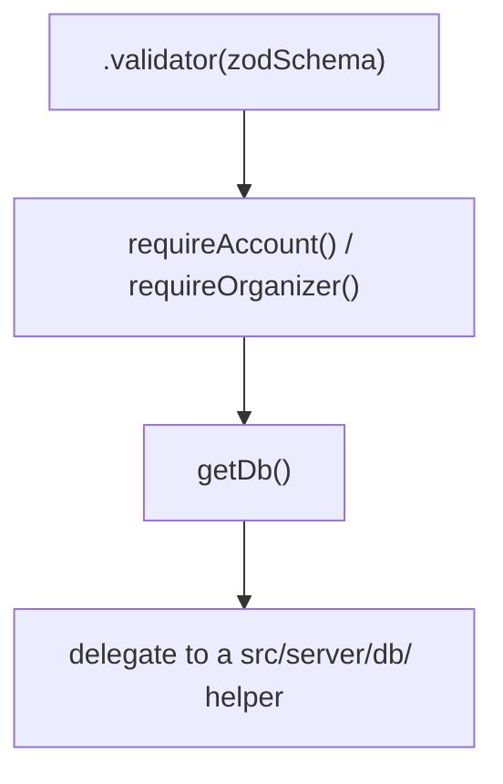

# Server Function Layer

> **Status**: Accepted (July 2026). Applies to the db-backed, guarded server
> functions in `src/lib/*-functions.ts`, not the content-loading loaders
> described in [Routing & Data Loading](routing-and-data-loading.md).

## Context

Team, organizer, account, and recovery actions are exposed to routes as
`createServerFn` handlers in `src/lib/*-functions.ts`. Each one follows the same
four-layer shape:



```ts
export const createTeamFn = createServerFn({ method: 'POST' })
  .validator(createTeamSchema)
  .handler(async ({ data }) => {
    const user = await requireAccount()
    const db = await getDb()
    return createTeam(db, { name: data.name, userId: user.id })
  })
```

There are ~25 such wrappers. With the auth guards now shared (see below), the
only lines repeated across them are `requireAccount()`/`requireOrganizer()` and
`getDb()`. That repetition is shallow, so it is fair to ask whether a builder —
`defineAccountAction(schema, handler)` — should absorb it.

Two supporting decisions make these wrappers as thin as they are:

- **Auth guards are shared.** The "who is this / are they an organizer" logic
  lives once in `src/server/auth-guards.ts` (`requireAccount`,
  `requireOrganizer`), not copy-pasted into each file. See
  [Authentication](authentication.md).
- **Domain rules live in dedicated modules.** Registration transitions live in
  `src/lib/registration-lifecycle.ts`; the db/ helpers own the SQL. The wrapper
  itself carries no business logic.

## Decision

**Keep each server function explicit. Do not introduce an action-builder
abstraction over `createServerFn`.**

The wrapper's job is to state, in plain sight, three things a reader (or auditor)
needs: the input contract (the Zod schema), the authorization gate (which guard),
and the delegate. All three stay visible at the call site.

## Consequences

- **The auth gate is greppable.** "Which server functions require organizer
  role?" is answered by searching for `requireOrganizer()`. A builder would hide
  the guard behind a helper name and defeat that audit.
- **The input contract stays front and centre.** `.validator(schema)` is each
  function's public interface; it is not boilerplate to be tucked into an
  argument position.
- **No wrapper fights the framework's types.** `createServerFn().validator()
  .handler()` threads method, inferred input, and inferred return type through a
  fluent generic chain. Preserving all of that through a custom builder is more
  machinery than the ~2 lines per function it would remove.
- **The cost is ~2 repeated lines per function.** Accepted knowingly as the price
  of an explicit, security-sensitive seam.

## Alternatives Considered

**A generic `defineGuardedAction(schema, guard, handler)` builder.** Would remove
the `requireAccount()`/`getDb()` lines. Rejected: the savings are marginal once
the guard bodies are already shared, it obscures the load-bearing Zod schema and
the auth gate, and wrapping the framework's typed builder chain faithfully adds
more complexity than it removes. Revisit only if the wrapper count grows large
enough that the repetition becomes a genuine maintenance cost.

## Revision History

- **2026-07-06** (Michael): Initial note. Records the guarded server-fn wrapper
  shape and the decision to keep it explicit rather than build an action-builder
  abstraction, following the auth-guard consolidation and the registration
  lifecycle extraction.
