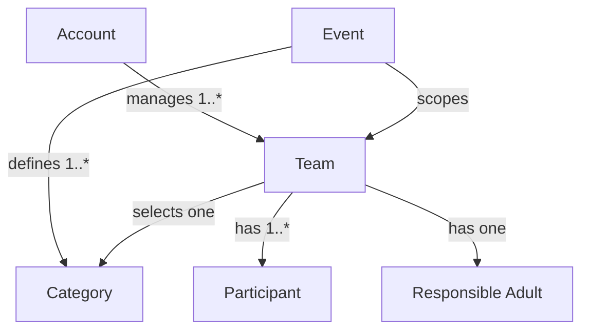
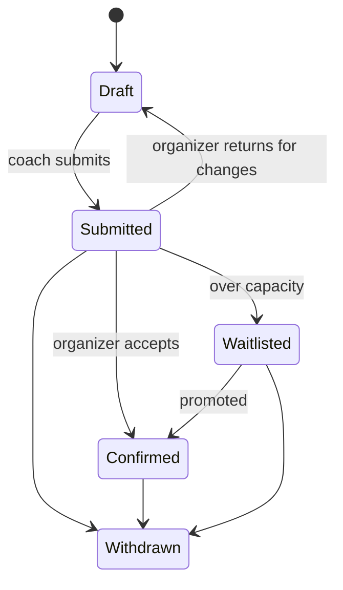

# Team Registration & Accounts

> **Status**: Proposed (July 2026). Nothing built yet; this captures the agreed shape before implementation.

## Table of Contents

1. [Problem / Context](#problem--context)
2. [Domain Model](#domain-model)
3. [Registration Lifecycle](#registration-lifecycle)
4. [Coach Experience](#coach-experience)
5. [Organizer Experience](#organizer-experience)
6. [Data Rights (GDPR)](#data-rights-gdpr)
7. [Fit With the Stack](#fit-with-the-stack)
8. [Forward Hook: The Bracket](#forward-hook-the-bracket)
9. [Alternatives Considered](#alternatives-considered)
10. [Revision History](#revision-history)

## Problem / Context

The `/signup` page is a placeholder. WRO Denmark needs teams to be able to
register for the competition and manage their entry, and organizers need to
review and confirm those entries and run the event. This is the site's first
feature requiring **persistence outside Git** and **authentication** — the
existing content layer (build-time Markdown) cannot model live, user-owned,
frequently-changing data.

The canonical vocabulary for this domain lives in `CONTEXT.md` at the repo root.
This document assumes those terms (Account, Team, Event, Category, Participant,
Responsible Adult, Registration Status, Organizer, etc.).

## Domain Model

- **Account** is the unit of login (a coach/registrant), not the Team. One
  Account manages one or more Teams and persists across Events (years).
- **Team**–**Account** is modelled as a *membership relationship*, not a single
  owner column. Today exactly one Account manages a Team; the relationship shape
  lets a second coach be added later (an invite flow) with **no migration** — but
  no invite flow is built now.
- **Event** scopes every Team registration and has a *kind*: **Competition**
  (ranked, feeds the bracket) or **Gathering** (RSVP/headcount only).
- **Category** is configured **per Event** (name + age band), because WRO's
  category lineup changes yearly. A Team selects exactly one.
- **Participant** is a student (name + birth year). Birth year — deliberately
  not full birthdate (data minimisation) — drives **age-band eligibility**
  checks, surfaced as **soft warnings** for organizers, never hard blocks.
- **Responsible Adult** is per-Team on-site contact info (name + phone, email
  optional), pre-filled from the Account but editable. It is **contact info, not
  a login**.
- **Organization** (school / club / parent group) is a single **optional** free
  text field on the Team.

## Registration Lifecycle

Registration is **organizer-confirmed** — a submission is a request, not a
guaranteed place.

**Payment Status** is tracked as a **separate flag** (unpaid / paid / waived),
recorded by organizers. Payment is **never collected online** by this system.

Assumed defaults (adjust if wrong):

- A **Draft** is freely editable and deletable by the coach.
- Once **Submitted**, the entry is locked from coach edits; an organizer can
  return it to Draft for changes.
- Each Event has a **registration deadline**; after it, no new entries or edits.
- Capacity/waitlisting is a **manual organizer action** (no automatic capacity
  enforcement in v1).

## Coach Experience

After passkey login (see [Authentication](authentication.md)), a coach lands on a
dashboard that:

- Lists the Teams they manage, each with a **status badge**.
- Lets them **create** a Team, **edit** Drafts, **submit**, and **withdraw**.
- Lets them **export** or **delete** their data (see below).
- Lets them **enroll additional passkeys** ("add this device") for self-service
  resilience.

## Organizer Experience

An Account with the **organizer role** (see [Authentication](authentication.md))
gets a unified admin landing with shared navigation to:

- **Registrations** — review, confirm, waitlist, return-to-draft, and withdraw
  Teams; set the payment flag; see eligibility warnings; manage **Events** and
  their **Categories**; generate account **recovery links**; and **export**
  registrations per Event as CSV (doubles as a check-in / category roster).
- **Content** — a link out to the existing **Sveltia CMS** at `/admin`, left on
  its own GitHub-based auth. The two systems share a front door, not an auth or
  storage layer (see [Alternatives Considered](#alternatives-considered)).

First organizers are bootstrapped via an **env email allowlist**: an Account that
signs up with an allowlisted email is granted the organizer role.

## Data Rights (GDPR)

Because the system stores **minors' personal data** (student names + birth
years), GDPR data-subject rights are first-class functionality, not an
afterthought:

- **Access / portability (Art. 15/20)** — a coach can **export their own data**
  (their Account, Teams, and Participants) in a portable format (CSV/JSON).
  Organizers can export **all registrations per Event** as CSV.
- **Erasure (Art. 17)** — a coach can **delete their Account and all associated
  Team/Participant data**. The UI **prompts them to export first**. (Any legal
  retention obligations for a live/completed Competition are a matter for the
  data-retention policy, noted here as a known consideration.)

Data minimisation is applied at the model level: birth *year* not birthdate, and
Organization/email-contact kept optional or contact-only.

## Fit With the Stack

- Auth, dashboard, and admin routes are **dynamic (not prerendered)** — they must
  be excluded from the prerender crawl, alongside the existing `/admin` exclusion
  (see [Routing & Data Loading](routing-and-data-loading.md)).
- Data access goes through **`createServerFn`** handlers called from route
  loaders — the same seam already used for content — but reading/writing Postgres
  instead of Markdown (see [Data Persistence](data-persistence.md)).
- Registration data is **fully separate** from the Git/Markdown content layer,
  which is unchanged.

## Forward Hook: The Bracket

A later competition-day bracket feature reads **Confirmed Teams grouped by
Category** within a Competition Event, and tracks scores. Nothing in this design
blocks it; the Event → Category → Team relationships are the join it will use.

## Alternatives Considered

**Team-as-login (shared per-team credential).** Simpler, but breaks down when a
coach runs multiple teams and forces credential-sharing among students.
Account-as-login with a Team membership relationship models reality better and is
future-proof.

**Instant self-service registration (no organizer confirmation).** Rejected —
WRO has capacity, eligibility, and fee realities; the status field is only
meaningful with a confirmation step, and confirmation is exactly what organizers
need.

**Hardcoded category list.** Rejected — WRO's categories change between seasons;
per-Event configuration avoids a code change every year.

**Fully merging the Sveltia CMS into the new admin.** Rejected — Sveltia is a
standalone SPA with GitHub-based Git auth; fusing it into passkey auth is
significant work for little gain. A shared landing + navigation gives the
"one admin" feel without an auth rewrite.

## Revision History

- **2026-07-04** (Michael): Initial proposal capturing the team registration
  domain model, lifecycle, coach/organizer experiences, and GDPR data rights.
